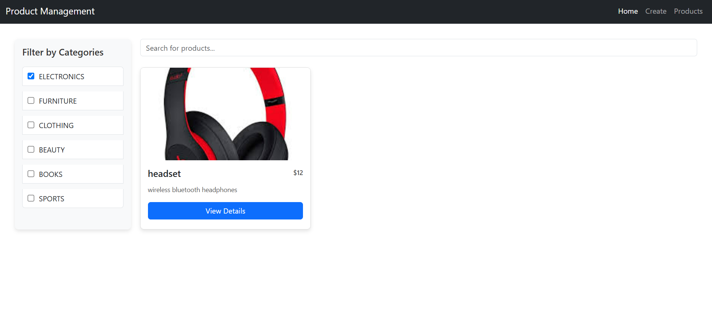
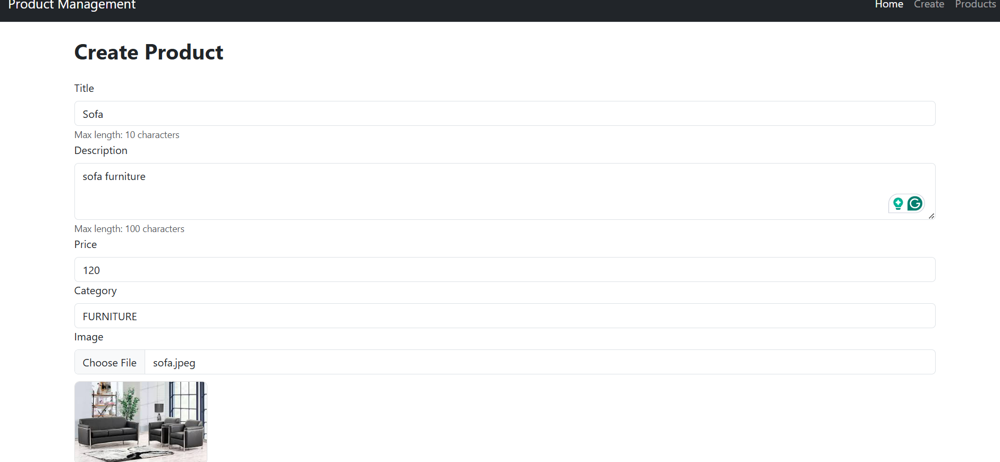
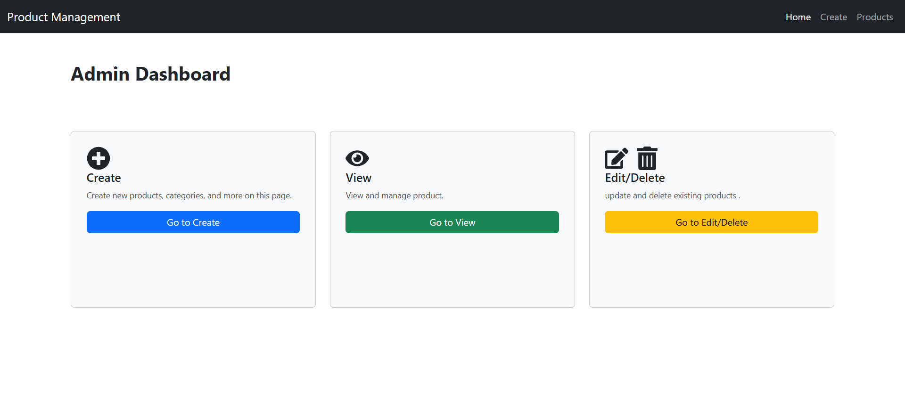
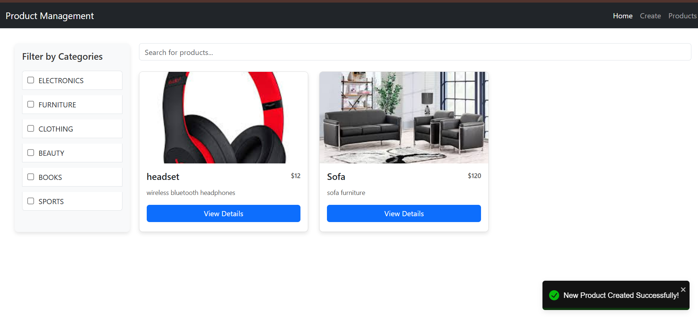

# Product Management Application
An Admin Dashboard for managing products, built with React for the front-end and Spring Boot for the back-end.

## 📸 Screenshots






## 🚀 Features

### Front-End (React)
- **Product Management Interface**: View, edit, and delete products.
- **Category-Based Filtering**: Easily filter products by category.
- **Search Functionality**: Search for products by name.
- **Toast Notifications**: Interactive notifications for user feedback.
- **Cloudinary Integration**: Seamless image hosting for product images.

### Back-End (Spring Boot)
- **RESTful API Endpoints**: Full CRUD operations for product management.
- **PostgreSQL Integration**: Persistent data storage using PostgreSQL.

## 🛠️ Tech Stack
- **Front-End**: React
- **Back-End**: Spring Boot
- **Database**: PostgreSQL
- **Image Storage**: Cloudinary

## 📋 Prerequisites
Before you start, ensure you have the following tools installed:
- Node.js
- Java JDK
- Maven
- PostgreSQL
- Cloudinary Account (for image storage)

## 🚀 Installation & Setup

### 1. Clone the Repository
```bash
git clone https://github.com/HasiniCha/HasiniCha-Product-Management-Dashboard.git

2.🚀 Back-End Setup
Configure PostgreSQL
Install PostgreSQL.
Create a new database:
sql
Copy code
CREATE DATABASE product_management_db;
Update the application.properties
properties
Copy code
spring.datasource.url=jdbc:postgresql://localhost:5432/product_management_db
spring.datasource.username=your_postgresql_username
spring.datasource.password=your_postgresql_password
spring.jpa.hibernate.ddl-auto=update
spring.datasource.driver-class-name=org.postgresql.Driver

🚀Configure Cloudinary
Sign up for a Cloudinary account at Cloudinary.
Add your credentials to application.properties:
properties
Copy code
cloudinary.cloud-name=your_cloud_name
cloudinary.api-key=your_api_key
cloudinary.api-secret=your_api_secret

3.🚀 Front-End Setup
Navigate to the frontend directory:

bash
Copy code
cd frontend
Install the required dependencies:

bash
Copy code
npm install
Update the API endpoint in src/api.js to point to your back-end server:

javascript
Copy code
const API_BASE_URL = "http://localhost:8081";

4. 🚀Configure Cloudinary in the Front-End
To enable image uploading with Cloudinary, configure the front-end to handle file uploads.

🛠️ In the CreateProduct.jsx file(line 80 and 83), add your Cloudinary Cloud Name and Upload Preset Name:

Update the following lines in CreateProduct.jsx  :
javascript
Copy code
imageData.append("upload_preset", "your_upload_preset_name_here");  // Line 80
javascript
Copy code
const imageResponse = await axios.post(
  "https://api.cloudinary.com/v1_1/your_cloud_name_here/image/upload",  // Line 83
  imageData
);
What you need to do:
Replace your_upload_preset_name_here with the upload preset you have created on Cloudinary.
Replace your_cloud_name_here with your Cloudinary Cloud Name.


🚀 Running the Application
Start the Back-End
In the root of the project, navigate to the backend folder and run:

bash
Copy code
cd backend
mvn spring-boot:run
The back-end server will start on http://localhost:8081.

Start the Front-End
In the frontend folder, run:

bash
Copy code
cd frontend
npm start
The front-end will open in your browser at http://localhost:3000.

🌐 Access the Application
You can access the application through your web browser at http://localhost:3000.
